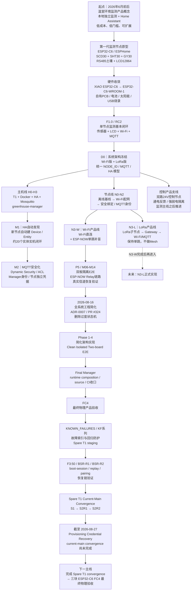

# 温室环境监测系统项目开发历程参考

- **项目**：温室环境监测系统（ESP32-C6）
- **文档版本**：V1.0
- **文档性质**：项目开发历史 / 架构演化 / 故障与节点目标参考
- **整理日期**：2026-08-27
- **适用范围**：ESP32-C6 监测节点、Wi-Fi / ESP-NOW / LoRa、T1、Home Assistant、Mosquitto、greenhouse-manager、N3-W / FC4、研发与验收流程
- **状态说明**：本文件是历史与当前状态参考，不构成新的物理操作、生产修改、Flash、Reset、Broker/Manager/HA 写操作或其他执行授权。

---

## 0. 文档目的

本文件用于把项目从最初的“ESP32-C6 温室监测节点”逐步演化为“本地优先、Home Assistant 自动接入、安全身份、双无线产品线、自动恢复和严格验收体系”的实际开发过程整理为长期参考资料。

重点记录：

1. 项目起点与产品目标；
2. 主要技术分支及其关系；
3. 各阶段节点目标与已形成的能力；
4. 开发中出现的主要问题；
5. 问题如何推动架构和测试方法发生变化；
6. 当前项目所处位置以及后续主线。

本文件不替代阶段性验收记录、PR、CI、Known Failures、交接文档或 exact-SHA 证据；涉及具体技术状态时，应以对应阶段的冻结材料为准。

---

# 1. 项目一句话演化

> 项目从“做一台可以读取温室传感器的 ESP32-C6 设备”，逐步演化成“具备离线独立运行、Home Assistant 自动接入、安全身份、Wi-Fi/LoRa 双产品线、ESP-NOW 单跳补盲、自动恢复和严格产品验收体系的边缘物联网系统”；随后又主动经历了一轮工程减法，把实验室级复杂性重新压回产品真正需要的范围。

---

# 2. 项目开发总历程



---

# 3. 按时间展开的实际开发历程

| 时间 | 阶段 / 主分支 | 节点目标 | 主要成果 | 主要问题 / 转折 |
|---|---|---|---|---|
| 2026-06 前后 | 产品概念 / MVP | 做一台真正能在温室独立工作的监测节点 | 本地采集、LCD、本地计算、HA 接入方向形成 | 需求范围容易膨胀，因此明确“监测先行、控制后置” |
| 6–7月初 | 硬件原型 | 完成空气、CO₂、光照、土壤采集 | ESP32-C6 + SCD30/SHT30/GY30/RS485/LCD | RS485 回显、土壤读数、供电、PCB 焊接等实机问题逐步暴露 |
| 7月初 | 硬件产品化 | 从开发板过渡到产品 PCB | XIAO → ESP32-C6-WROOM-1 8MB；GPIO、USB、LoRa、供电布局逐步冻结 | 重新解决 MCU 外围、天线、UART、LDO、strapping 等工程问题 |
| 7月10日前后 | D0 / V0.5 | 冻结产品架构 | 正式拆成 Wi-Fi / LoRa 双 SKU；ESP-NOW 和 LoRa 均只做单跳 | 修复 Wi-Fi/ESP-NOW/LoRa 定位冲突及 N1/N2 阶段依赖倒置 |
| 7月11日前后 | M1 | 普通用户无需手工建立 HA 实体 | greenhouse-manager + MQTT Discovery；实机约 20 个实体 | 需要解决新增节点无需重启 HA、统一 Device 身份等问题 |
| 7月中旬 | M2 | 从 anonymous MQTT 走向节点独立身份 | Manager/HA 身份迁移、DynSec/ACL、candidate/fallback、隔离 Broker 测试 | 生产节点不能直接迁移；需要保证错误凭据、Broker 故障、回退路径安全 |
| 7月下旬 | H3 / N2 | 完成安全发现、配对、凭据生命周期 | TLS、首次信任、NODE_ID、registration、replay 等体系逐步建立 | 安全状态机开始明显复杂化 |
| 8月7–10日 | P5 两板隔离 E2E | 验证真实 ESP-NOW Child → Relay → Manager | 两板编译、隔离环境、Broker/HA/Manager 闭环 | Docker、Broker health、ARM64、私有包和物理 gate 等工程问题 |
| 8月11–14日 | M06–M14 / ESP-NOW恢复 | 验证 Direct/Relay 与信道恢复 | AP 信道改变后两板自动恢复；Relay 上报链路实证 | 信道、replay、缓存、重发等机制比预想复杂 |
| 8月16日 | 系统级架构简化 | 保留产品能力，同时大幅减少协议状态 | Setup Secret/HMAC、Manager 去重、单帧 telemetry、删除不必要 PATH lease 等方向冻结 | 核心转折：确认部分机制存在过度设计 |
| 8月17–18日 | Phase 1–4 | 实现并证明简化 N3-W | Host prototype → firmware → Clean Two-board E2E | Simplified runtime、物理 executor、CI 与真实板行为之间出现差异 |
| 8月19–21日 | Final Manager / FC4 | 把实验架构收口成最终 Manager 产品路径 | Final Manager source successor、Spare T1 staging、CI、KF048 修复 | Ruff、依赖缺失、容器入口点、ARM64 镜像、公开仓库安全等问题 |
| 8月21日以后 | KNOWN_FAILURES | 防止同一错误再次发生 | 建立 `KNOWN_FAILURES_AND_REGRESSION_GUARDS.md` | 开发由“修当前问题”升级为“现象 → 根因 → 修复 → 回归防护” |
| 8月22–23日 | F3:50 / BSR-R2 | 验证重启后身份、replay、pairing 可安全恢复 | 找到 boot-session 实际为 runtime-ready 后懒分配 | executor 在错误时点判断 `BOOT_SESSION_DID_NOT_ADVANCE`；测试 oracle 与产品行为需要区分 |
| 8月23日以后 | Broker / recovery 支线 | 恢复 FC4 基础设施但不破坏历史状态 | Broker publication、TLS、Manager stability 等恢复 | Docker publication、Broker restart-loop 等基础设施故障不能直接等同产品失败 |
| 8月25–27日 | R1-V2C / S1 / S2R1 / S2R2 | Spare T1 收敛到 current-main 后再开始三板验收 | exact image / successor / state reuse 等大量绑定已证明 | MQTT identity drift、CA binding、provisioning credential 与 password authority 漂移、错误 live rollback 等 |
| 当前 | S2R2 Provisioning Recovery | 恢复 provisioning credential，再恢复 current-main Manager | candidate 已进行隔离验证，继续按 gate 推进 | FC4 三板最终物理验收尚未正式开始；recovery 支线不能误写成产品主线完成 |

---

# 4. 项目分支树

```text
温室环境监测系统
│
├── A. 节点硬件线
│   ├── XIAO ESP32-C6 原型
│   ├── ESP32-C6-WROOM-1 自有PCB
│   ├── 传感器 / RS485 / LCD
│   ├── 电池 / 太阳能 / 电源管理
│   └── LoRa SKU：EWM22M-400T22S
│
├── B. 主机 / Home Assistant线
│   ├── T1 + Docker
│   ├── Home Assistant
│   ├── Mosquitto
│   ├── greenhouse-manager
│   └── 自动发现 / 历史 / 告警
│
├── C. 安全与身份线
│   ├── NODE_ID
│   ├── MQTT独立身份
│   ├── TLS / CA
│   ├── 配对 / Setup Secret
│   ├── credential generation
│   └── retirement / replay
│
├── D. N3-W Wi-Fi产品线   ← 当前主线
│   ├── Direct Wi-Fi
│   ├── ESP-NOW Child
│   ├── Relay
│   ├── Manager dedup
│   └── FC4最终物理验收
│
├── E. N3-L LoRa产品线
│   ├── LoRa Child
│   ├── Gateway
│   ├── Wi-Fi/MQTT回传
│   └── 正式实现延后
│
└── F. 产品化 / 质量线
    ├── GitHub PR / CI
    ├── exact SHA / artifact
    ├── KNOWN_FAILURES
    ├── Spare T1 staging
    ├── physical gate
    └── backup / recovery / rollback
```

---

# 5. 主要产品与架构节点

## 5.1 节点本地独立能力

产品长期保持以下原则：

```text
Wi-Fi
ESP-NOW
LoRa
MQTT
Manager
Home Assistant
Internet
```

即使全部不可用，监测节点仍必须继续：

```text
传感器采集
LCD 五页显示
本地 VPD / 露点 / 绝对湿度等计算
必要本地保护
电池 / 电源管理
```

联网属于增强能力，不是本地监测的启动前提。

## 5.2 双产品线

最终长期产品方向收敛为两种 SKU：

```text
SKU-WIFI：Wi-Fi 环境监测节点
SKU-LORA：LoRa 环境监测节点
```

共同原则：

- ESP32-C6-WROOM-1；
- 统一身份与上层数据模型；
- Home Assistant 设备身份不因传输路径改变；
- Wi-Fi / LoRa 均只做单跳补盲或汇聚；
- 不做 ESP-NOW Mesh；
- 不做 LoRa Mesh；
- Relay / Gateway 是运行角色，而不是第三种硬件 SKU。

## 5.3 Home Assistant / Manager

主机侧逐步从“MQTT 能收到数据”演化为：

```text
节点注册
→ 独立身份
→ ingress校验
→ 去重
→ canonical state
→ MQTT Discovery
→ Home Assistant Device / Entity
```

Manager 的角色也由早期发现服务演化为系统 authority，包括：

- 节点注册；
- MQTT 身份；
- 凭据生命周期；
- 传输入口校验；
- 去重与状态收敛；
- availability；
- Discovery；
- retirement / recovery 等节点生命周期管理。

---

# 6. 最重要的“问题 → 架构变化”

| 暴露的问题 | 最初做法 | 后来的判断 | 对项目造成的长期改变 |
|---|---|---|---|
| Wi-Fi 覆盖不足 | 尝试扩大无线功能 | Wi-Fi 与 LoRa 分 SKU | N3-W / N3-L 正式分线 |
| ESP-NOW telemetry 可靠性 | fragment + ACK + resend + reorder | 周期 telemetry 不必保证每包必达 | 改为“最新状态持续前进” |
| Relay 唯一性 | PATH owner / lease / candidate | 重复转发 + Manager 去重通常更便宜 | BOOT_ID/SEQ 去重成为重要收敛方向 |
| 安全配对过于复杂 | X25519、finite grant、TTL、epoch 等 | Setup Secret + HMAC/HKDF 更符合产品实际 | N3-W 安全架构简化 |
| NODE_ID 分配复杂 | 操作员介入 | Manager 自动生成稳定 ID 更符合零配置目标 | 降低部署门槛 |
| MQTT 认证迁移风险 | 直接迁移到安全模式 | candidate/fallback、隔离测试、fail-closed | 安全迁移体系形成 |
| ESP-NOW 信道改变 | 可能依赖人工重启 | 实板证明可以自动恢复 | 自动信道恢复成为正式验收能力 |
| 测试脚本报告失败 | 容易直接归为产品失败 | 必须区分产品 bug / executor bug / infrastructure drift | FC4 测试方法发生变化 |
| 相同错误重复出现 | 分散在对话和交接文档 | 建立 Known Failures 索引 | 正式形成回归防护体系 |
| 测试流程不断复杂化 | 异常后继续叠加 gate / successor | 测试框架本身也需要被审计和简化 | 开始治理 evidence / authorization / recovery 复杂度 |
| Spare T1 current-main convergence 阻塞 | 继续围绕 Manager 排查 | 逐步定位到 provisioning credential / password authority 漂移 | 当前 S2R2 recovery 支线 |

---

# 7. 2026-08-16 的关键转折：从“增加可靠性机制”转向“架构减法”

这一阶段不是降低产品能力，而是主动删除为了“绝对唯一、绝对不丢、绝对可证明”而不断叠加的状态机。

简化后的工程判断顺序逐步收敛为：

```text
幂等
→ 去重
→ 下一周期自然恢复
→ bounded retry
→ reconciliation
→ 最后才是复杂状态机
```

并明确区分两类数据：

### 周期 telemetry

目标：

```text
最新状态持续前进
```

不是：

```text
每一条历史采样都必须通过无线链路可靠送达
```

### 配置 / 凭据 / 控制 / OTA

目标：

```text
必须明确成功或失败
```

这些操作仍可使用 ACK、重试或事务。

这个变化直接影响了 ESP-NOW、PATH lease、peer trust、registration、LoRa gateway、retirement、MQTT Broker 与研发 gate 等多个子系统。

---

# 8. 项目成熟过程中的四次“换挡”

```text
第一次
“能读传感器”
        ↓
“能成为一个完整监测节点”

第二次
“能把 MQTT 发出去”
        ↓
“普通用户接入后，HA 自动出现设备与实体”

第三次
“实验室无线通信能工作”
        ↓
“身份、安全、恢复、Direct/Relay 都能长期运行”

第四次
“功能越做越完整”
        ↓
“主动删除不必要复杂度，转向真正的产品工程”
```

第四次变化尤其重要：产品边界没有被削弱，主要删除的是不必要的 durable state、握手、租约和自建可靠传输机制。

---

# 9. 测试与研发方法的演化

项目后期的一个重要成果不是新功能，而是测试方法本身逐步产品化。

## 9.1 早期

```text
功能失败
→ 修改代码
→ 再跑测试
```

## 9.2 中期

```text
冻结 exact SHA
→ 私有包 / candidate
→ isolated test
→ physical gate
→ evidence
→ PR / CI
```

## 9.3 后期

发现测试体系本身也可能出现：

- executor 时序判断错误；
- evidence oracle 错误；
- runtime composition 与源码不一致；
- Docker / Broker / ARM64 基础设施故障；
- live state 漂移；
- secret authority 漂移；
- recovery successor 过度复杂。

因此形成新的分类原则：

```text
PRODUCT BUG
EXECUTOR / TEST BUG
INFRASTRUCTURE FAILURE
STATE / CREDENTIAL DRIFT
EXPECTED RECOVERY BRANCH
```

不能再把任何“脚本 FAIL”直接等同于产品功能失败。

---

# 10. Known Failures 与回归防护

项目在 2026-08-21 前后正式建立：

```text
docs/development/KNOWN_FAILURES_AND_REGRESSION_GUARDS.md
```

其目的不是保存完整事故报告，而是建立可以快速阅读、定位和闪避历史问题的索引。

推荐持续采用：

```text
现象
→ 根因
→ 修复
→ 回归保护
```

的最小记录方式。

这个机制标志着项目开始由“修当前故障”转为“建立不会重复犯同类错误的工程体系”。

---

# 11. 当前项目位置（截至 2026-08-27）

以下条形仅表示工程阶段位置，不是精确完成率：

```text
产品定义          ████████████████████  已稳定
节点硬件          ███████████████████░  高度收敛
HA / Manager      ███████████████████░  高度收敛
MQTT / 身份安全   ██████████████████░░  收口中
N3-W ESP-NOW      ██████████████████░░  已完成核心E2E
架构简化          ███████████████████░  基本完成
FC4产品验收       ██████████████░░░░░░  最后收口阶段
Spare T1收敛      ████████████░░░░░░░░  当前工作点
三板最终验收      ░░░░░░░░░░░░░░░░░░░░  尚未正式开始
N3-L LoRa正式开发 ░░░░░░░░░░░░░░░░░░░░  刻意延后
```

当前主线应理解为：

```text
Spare T1 current-main convergence
→ FC4 三块 ESP32-C6 最终物理验收
→ N3-W Final Product E2E closure
```

当前 S2R2 provisioning credential recovery 是为了回到这条主线而存在的恢复支线，而不是最终产品目标本身。

---

# 12. 后续主线

## 12.1 近期

1. 完成 Spare T1 current-main convergence；
2. 保证 Manager / Broker / provisioning / credential authority 与 current-main exact binding 一致；
3. 冻结恢复后的 production-equivalent staging；
4. 开始三块 ESP32-C6 FC4 Final Physical Acceptance；
5. 形成 N3-W 最终产品 E2E closure。

## 12.2 后续

N3-W 真正收口后再进入 N3-L 正式开发：

```text
LoRa Child
→ LoRa Gateway role
→ Wi-Fi / MQTT
→ Manager
→ Home Assistant
```

继续保持：

- 单跳；
- 无 Mesh；
- Gateway 不成为第三种 SKU；
- Manager 负责统一去重与 canonical state；
- 无线合规参数在量产前单独冻结。

---

# 13. 长期不应丢失的项目原则

1. 节点必须可以离线独立工作；
2. 产品只有 Wi-Fi / LoRa 两个硬件 SKU；
3. 新增节点不能要求旧节点重新刷写；
4. NODE_ID 不因 Direct / Relay / Gateway 路径变化；
5. 每节点独立 MQTT 身份；
6. 不使用所有节点共用一个 MQTT 密码；
7. 不做 ESP-NOW Mesh；
8. 不做 LoRa Mesh；
9. 监测节点不直接驱动强电；
10. Home Assistant 原生能力优先；
11. 一个事实只能有一个 authority；
12. 普通 telemetry 优先保证“最新状态前进”，而不是自建完整可靠传输层；
13. 高风险控制、凭据、OTA 必须明确成功或失败；
14. 新故障应同步进入 Known Failures / Regression Guards；
15. 测试失败必须先分类，不能自动等同产品失败；
16. exact SHA、runtime、artifact、evidence 与 live state 之间必须有可证明绑定；
17. recovery 机制不能比被恢复的产品本身更复杂；
18. 新增复杂机制必须能回答其真实用户价值和不可替代性。

---

# 14. 参考入口

建议阅读本文件时结合以下仓库材料：

- `docs/development/KNOWN_FAILURES_AND_REGRESSION_GUARDS.md`
- `docs/development/KF-050_N3W_BOOT_SESSION_CONTRACT_REPAIR.md`
- `docs/development/N3W_F350_Codex_Development_RCA_Test_Archive_20260823.md`
- `docs/development/N3W_F350_KF060_Source_Closure_20260824.md`
- repository 中 N3-W / FC4 / Phase 4 / pairing recovery / current-main convergence 相关 PR、CI 和归档材料

对于某一阶段的最终判定，应始终优先查阅该阶段 exact SHA 对应的 closure、PR、CI 与物理 evidence，而不是只依赖本综述文件。

---

# 15. 维护规则

本文件建议作为“高层项目时间线”，只在发生下列变化时更新：

- 进入新的正式开发阶段；
- 产品线或核心架构发生变化；
- 关键物理验收正式闭环；
- 出现会改变长期工程方法的重要故障；
- N3-W / N3-L / FC4 等主里程碑发生状态变化。

普通单次故障仍应优先更新：

```text
docs/development/KNOWN_FAILURES_AND_REGRESSION_GUARDS.md
```

避免把本文件变成逐次执行日志。
